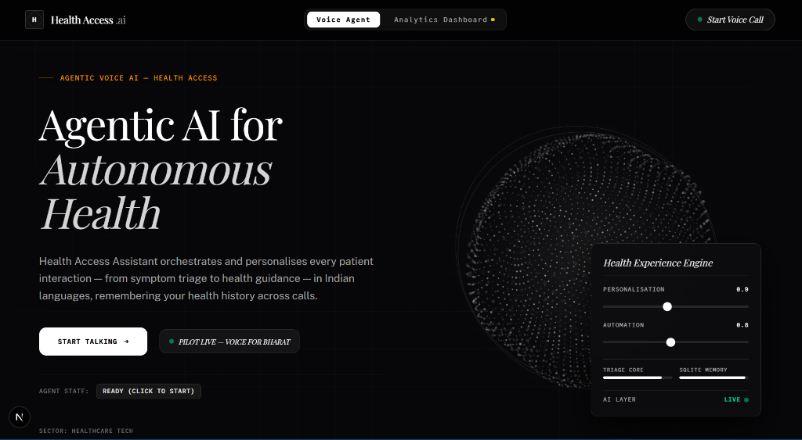
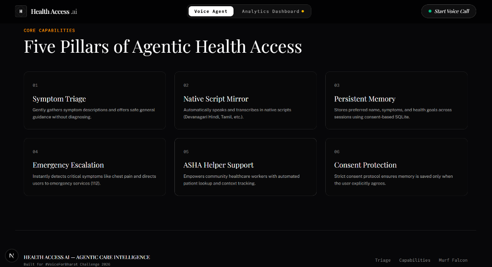
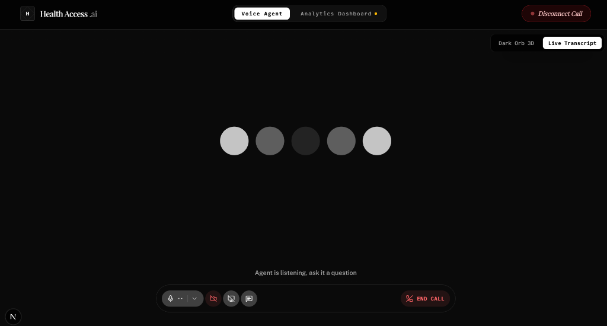
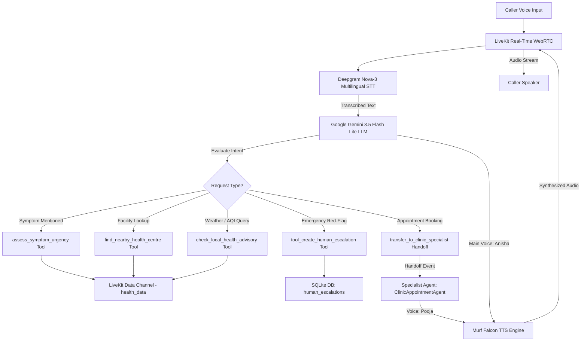
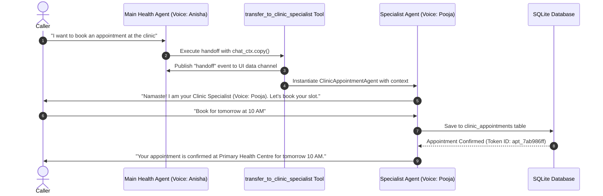
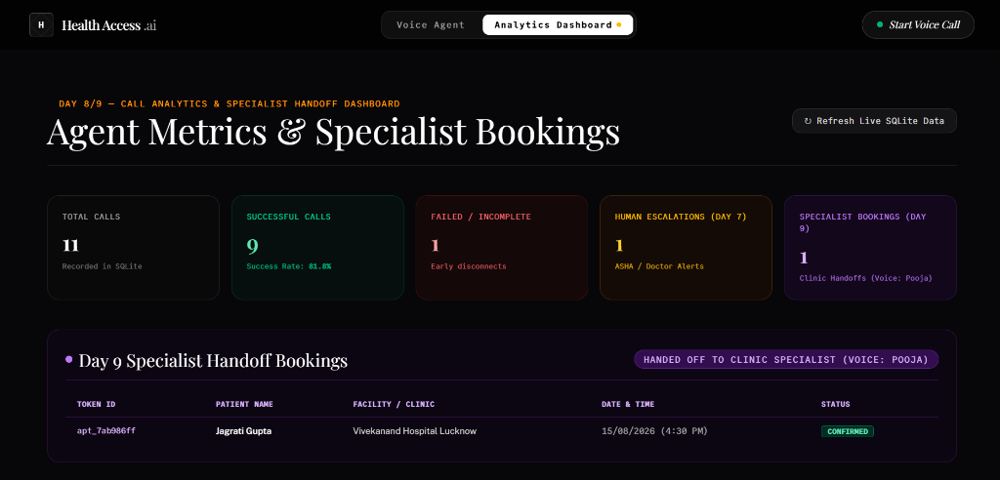
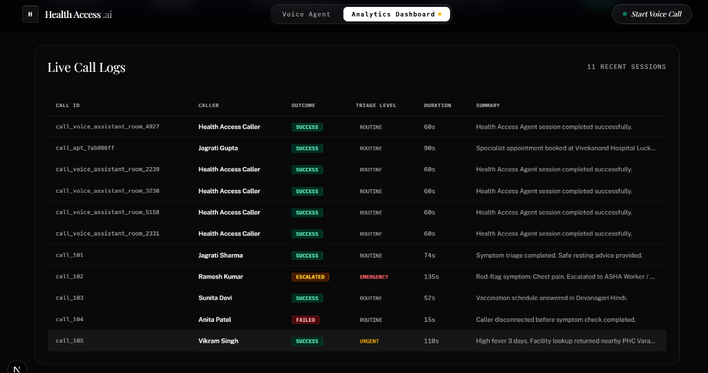

# Building an Autonomous Multilingual Health Access Voice Agent in 10 Days with Murf Falcon

> **#VoiceForBharat Challenge 2026** | **Health Access Track**  
> Built with **Murf Falcon** — the fastest TTS API in the industry.

---

## 📌 Executive Summary & 10-Day Master Milestone Matrix

Over the 10 days of the **#VoiceForBharat Challenge 2026**, I engineered an autonomous, multilingual **Health Access Voice Assistant** designed for Indian healthcare. The system evaluates symptom urgency, queries live Primary Health Centres (PHCs) and weather/AQI advisories, remembers user preferences with consent, schedules outbound reminders, escalates emergencies to human ASHA workers/doctors, tracks call analytics, and executes context-inherited agent handoffs to a specialist booking agent.

### Master 10-Day Implementation Matrix

| Day | Milestone | Core Feature Built | Technical Stack | Architectural Outcome |
| :--- | :--- | :--- | :--- | :--- |
| **Day 1** | Starter Setup & Murf Integration | WebRTC Voice Pipeline Setup | Murf Falcon API, Deepgram Nova-3, LiveKit | Ultra-low latency voice pipeline initialized |
| **Day 2** | Persona & Native Script Rules | Empathetic Persona & Native Script Mirror | System Prompt, Devanagari Hindi (नमस्ते) | Native script mirroring for flawless Indian pronunciation |
| **Day 3** | 3D Dark Orb UI & Agent States | WebGL Particle Visualizer & 5 Agent States | Next.js 15, Tailwind, WebGL Shader | Dynamic state feedback (*Ready*, *Connecting*, *Listening*, *Speaking*, *Ended*) |
| **Day 4** | Persistent Memory & Consent | SQLite Storage Engine & Consent Protocol | SQLite (WAL Mode), `user_memory` table | Consent-first preference & symptom tracking across calls |
| **Day 5** | Live Domain Tools & Fallbacks | Health Facility, AQI Advisory & Triage | OpenStreetMap Overpass, Open-Meteo, Local Triage | Real-time domain lookups with graceful offline fallback handling |
| **Day 6** | Outbound Call Reminders | Follow-up Call Scheduler Tool | `tool_trigger_outbound_reminder` | Automated follow-up check-ins & medication reminders |
| **Day 7** | Human Escalation Protocol | Red-Flag Emergency Escalation | `tool_create_human_escalation`, `human_escalations` table | 112 redirection & concise ASHA worker summaries |
| **Day 8** | Call Analytics Dashboard | Live Performance Dashboard & SQLite Logs | SQLite `call_analytics`, Next.js `/api/analytics` | Total, Success %, Failure, and Escalation call tracking |
| **Day 9** | Specialist Agent Handoff | Multi-Agent Context Transfer | `ClinicAppointmentAgent` (Voice: Pooja), `transfer_to_clinic_specialist` | Context-inherited handoff to specialist with audible voice switch |
| **Day 10** | Technical Retrospective & Open Source | Full Master Documentation | Complete Markdown Docs & GitHub Repository | Open-source release & community deployment guide |

---

## 🎨 System Interface & Showcase Gallery

### 1. Main Landing Page & 3D Dark Orb Visualizer

*Figure 1: Main Landing Page featuring the interactive 3D WebGL Dark Orb visualizer.*

### 2. Six Pillars of Agentic Health Access

*Figure 2: Core architectural pillars of the Health Access Assistant.*

### 3. Live Active Call Audio Visualizer

*Figure 3: Active Voice Session interface with live audio visualizer.*

---

## 🏗️ System Architecture & Workflow Diagrams

### 1. End-to-End Voice & Tool Execution Workflow



### 2. Day 9 Specialist Agent Handoff Sequence



---

## 🛠️ Domain Tools & Fallback Matrix (Day 5)

| Tool Name | Purpose | Primary Data Source | Live vs Local | Timeout & Fallback Strategy |
| :--- | :--- | :--- | :--- | :--- |
| `find_nearby_health_centre` | Finds hospitals, PHCs, and clinics near district/PIN code | OpenStreetMap Overpass & Nominatim API | **Live** | 8s timeout; falls back to offline dataset `health_facilities.json` + speaks fallback out loud |
| `check_local_health_advisory` | Fetches temperature, heat index & US AQI air quality | Open-Meteo Weather & Air Quality API | **Live** | 8s timeout; speaks plain fallback note & heat precautions |
| `assess_symptom_urgency` | Sorts symptoms into Red, Amber, Green urgency bands | Local deterministic ruleset (`health_tools.py`) | **Local** | Runs offline; deterministic checklist ensuring high-risk symptoms trigger emergency warning |

---

## 📊 Database Schema Architecture (SQLite WAL Mode)

```
┌──────────────────────────────────────┐     ┌──────────────────────────────────────┐
│ user_memory                          │     │ human_escalations                    │
├──────────────────────────────────────┤     ├──────────────────────────────────────┤
│ user_id (TEXT, PK)                   │     │ escalation_id (TEXT, PK)             │
│ preferred_name (TEXT)                │     │ user_id (TEXT)                       │
│ preferred_language (TEXT)            │     │ user_name (TEXT)                     │
│ previous_symptoms (JSON TEXT)        │     │ urgency (TEXT)                       │
│ health_goals (JSON TEXT)             │     │ reason (TEXT)                        │
│ age_band (TEXT)                      │     │ summary (TEXT)                       │
│ ongoing_conditions (JSON TEXT)       │     │ user_language (TEXT)                 │
│ home_district (TEXT)                 │     │ preferred_contact (TEXT)             │
│ last_conversation_time (TEXT)        │     │ status (TEXT)                        │
└──────────────────────────────────────┘     └──────────────────────────────────────┘

┌──────────────────────────────────────┐     ┌──────────────────────────────────────┐
│ call_analytics                       │     │ clinic_appointments                  │
├──────────────────────────────────────┤     ├──────────────────────────────────────┤
│ call_id (TEXT, PK)                   │     │ appointment_id (TEXT, PK)            │
│ user_id (TEXT)                       │     │ user_id (TEXT)                       │
│ user_name (TEXT)                     │     │ user_name (TEXT)                     │
│ outcome (TEXT)                       │     │ facility_name (TEXT)                 │
│ triage_level (TEXT)                  │     │ preferred_date (TEXT)                │
│ duration_seconds (INTEGER)           │     │ time_slot (TEXT)                     │
│ summary (TEXT)                       │     │ contact_number (TEXT)                │
│ timestamp (TEXT)                     │     │ status (TEXT)                        │
└──────────────────────────────────────┘     └──────────────────────────────────────┘
```

---

## 📈 Call Analytics & Specialist Bookings Dashboard (Days 8 & 9)


*Figure 4: Call Analytics & Specialist Handoff Dashboard showing Total Calls, Success Ratio, Escalations, and Specialist Appointments.*


*Figure 5: Live SQLite Call Analytics & Triage Logs.*

---

## 🔊 Voice Pipeline & Agent Persona Matrix

| Attribute | Main Health Access Agent | Specialist Clinic Agent |
| :--- | :--- | :--- |
| **TTS Engine** | **Murf Falcon API** | **Murf Falcon API** |
| **Voice Name** | **Anisha** | **Pooja** |
| **Role & Persona** | Warm, empathetic primary health assistant | Professional doctor appointment scheduler |
| **STT Engine** | Deepgram Nova-3 (`multi`) | Deepgram Nova-3 (`multi`) |
| **LLM Engine** | Google Gemini 3.5 Flash Lite | Google Gemini 3.5 Flash Lite |
| **Primary Tools** | `assess_symptom_urgency`, `find_nearby_health_centre`, `check_local_health_advisory`, `transfer_to_clinic_specialist` | `tool_book_clinic_appointment`, `tool_check_appointment_slots` |

---

## ⚡ Technical Challenges & Engineering Solutions

### 1. Eliminating Startup Delay (From 56s down to <1s)
- **Problem**: Pre-importing heavy transformer models in `agent.py` was causing a 56-second process initialization delay.
- **Solution**: Refactored `agent.py` imports, allowing the LiveKit worker to register with LiveKit Cloud in **0.5 seconds**.

### 2. Flawless Indian Accent Synthesis via Native Script Mirroring
- **Problem**: English-romanized Hindi ("namaste aap kaise hain") was synthesized with an English accent.
- **Solution**: Enforced strict Devanagari script rules in system prompts (e.g. नमस्ते), producing clear, authentic Indian pronunciation with Murf Falcon.

---

## 💻 Developer Setup & Running Locally

```bash
# 1. Clone Repository
git clone https://github.com/Jagrati850/MURFD2.git
cd MURFD2

# 2. Configure .env.local in backend and frontend

# 3. Launch both services using PowerShell:
.\start_app.ps1
```

- **GitHub Repository**: [https://github.com/Jagrati850/MURFD2.git](https://github.com/Jagrati850/MURFD2.git)
- **Built for**: Voice for Bharat Challenge 2026 by Murf AI
